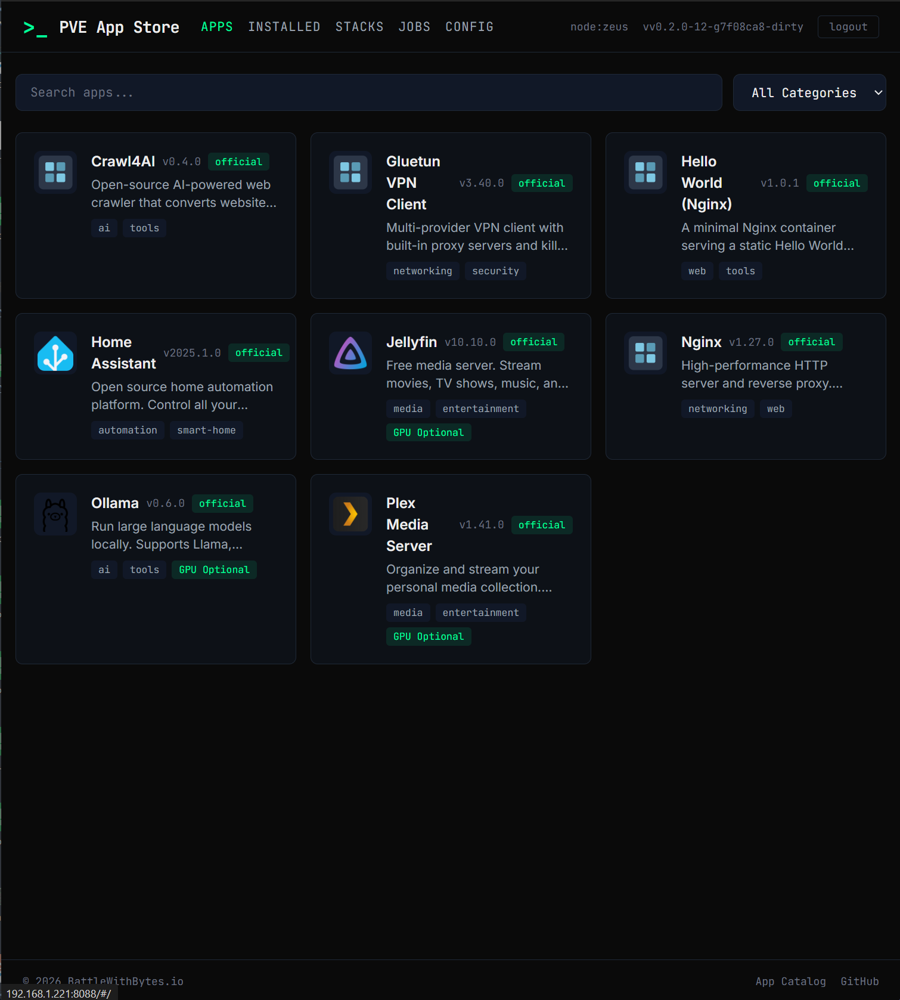
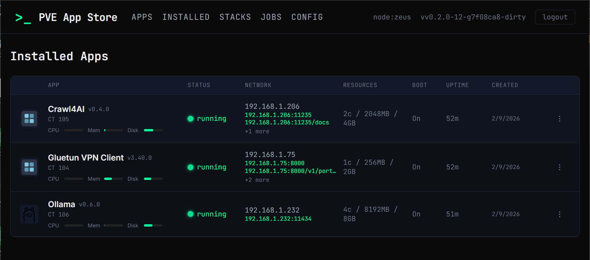
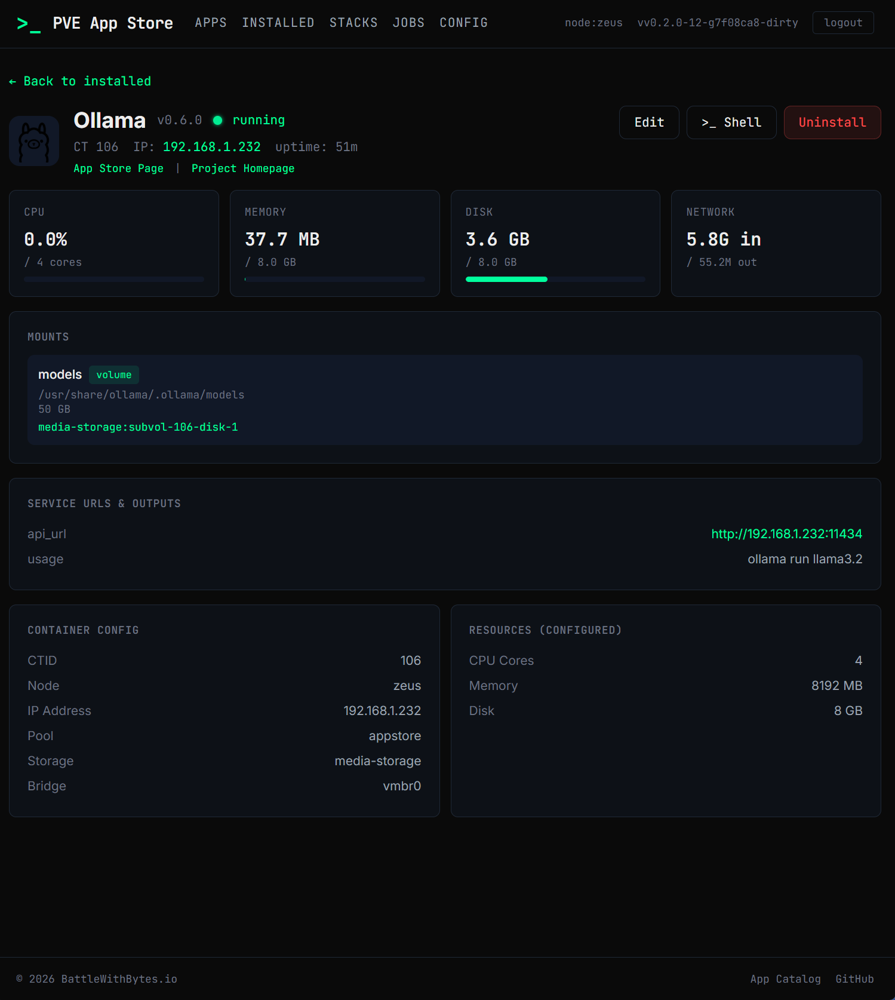
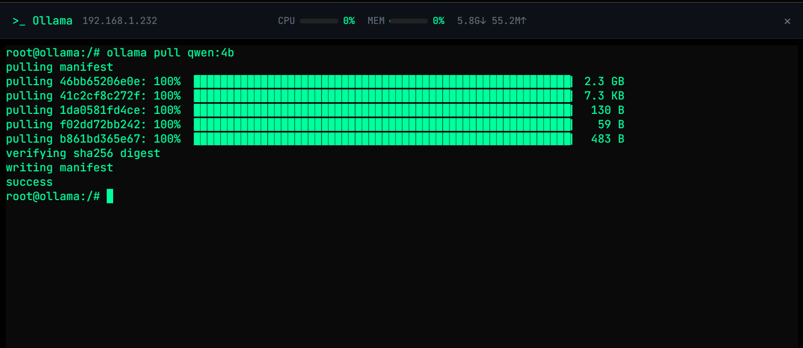
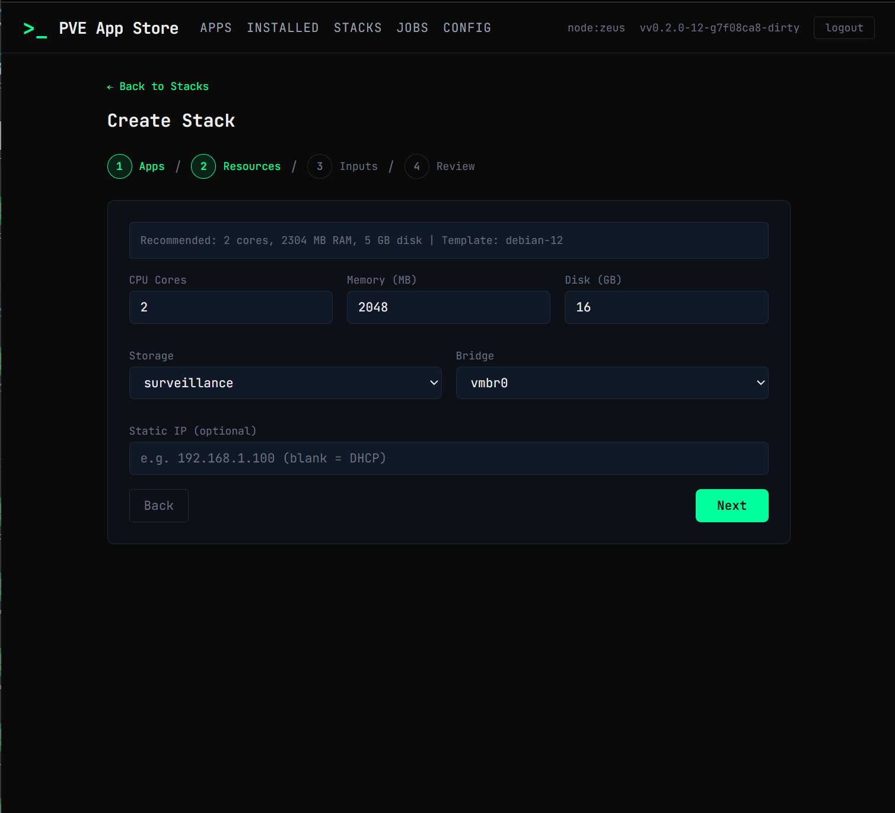
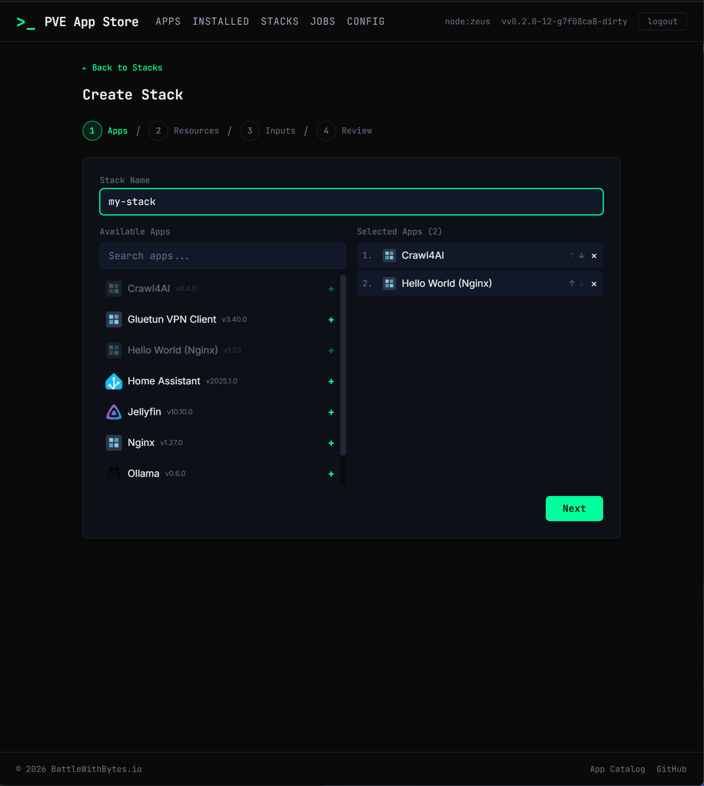
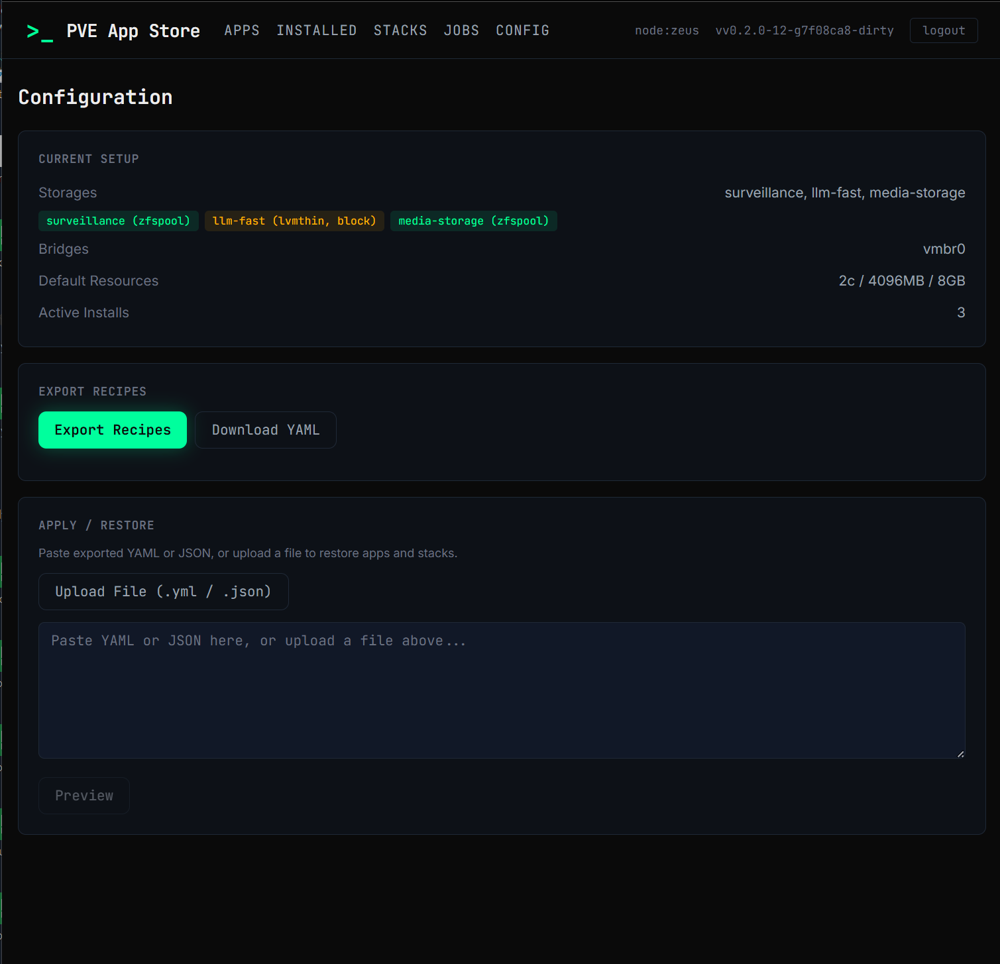
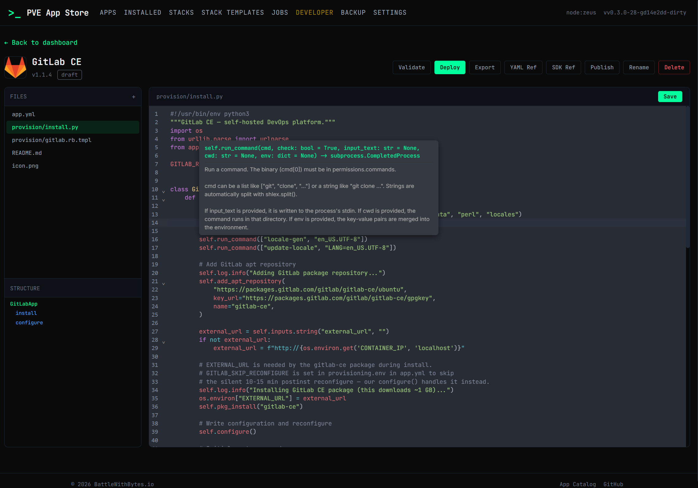

# PVE App Store

An app store for Proxmox VE — install self-hosted apps in one click.

PVE App Store lets you browse a catalog of self-hosted applications and deploy them as LXC containers on your Proxmox server, all from a web UI. Pick an app, tweak a few settings, and the store handles container creation, networking, and provisioning automatically.



## Highlights

- **One-click install** from a web UI — no manual container setup or shell scripts
- **Growing catalog** of apps in a [separate Git repo](https://github.com/battlewithbytes/pve-appstore-catalog), from media servers to AI tools
- **Multi-app stacks** — export/import groups of apps as a single YAML file
- **GPU passthrough** — Intel QSV and NVIDIA profiles for transcoding and AI workloads
- **Config backup & restore** — save your installs and settings as portable YAML
- **Sandboxed provisioning** — apps run through a Python SDK with enforced permission boundaries
- **Developer mode** — build, test, and deploy custom apps with a built-in code editor, validation, and Dockerfile import
- **In-place reconfigure** — change app settings and container resources without rebuilding

## Quick Start

**Prerequisites:** Proxmox VE 8.x on a single node.

```bash
curl -fsSL https://github.com/battlewithbytes/pve-appstore/releases/latest/download/install.sh | bash
```

The installer will:

1. Detect your Proxmox host and CPU architecture
2. Download the latest release binary
3. Walk you through a setup wizard (API token, catalog URL, storage, network bridge)
4. Create a systemd service and start the web UI

Open **http://your-proxmox-ip:8088** to browse and install apps.

## App Catalog

Apps live in a [separate catalog repo](https://github.com/battlewithbytes/pve-appstore-catalog) — browse it for the full list, manifest schema, SDK reference, and contribution guide.

## Screenshots

### Installed Apps

Live status, resource bars, network links, and uptime — all refreshed from the Proxmox API.



### Install Detail

Per-container metrics (CPU, memory, disk, network), mount points, service URLs, and container config at a glance.



### Web Terminal

Drop into any container shell directly from the browser.



### Multi-App Stacks

Bundle multiple apps into a single container with a step-by-step wizard.




### Config Export & Restore

Back up all installs and stacks as portable YAML, then restore on another node.



## How It Works

The catalog is a Git repository of app manifests (YAML + Python install scripts). PVE App Store clones it locally and serves the catalog through a web UI. When you install an app, a job engine creates an LXC container via the Proxmox REST API, pushes the install script inside, and runs it through a sandboxed Python SDK that enforces declared permissions.

## Developer Mode

Build custom apps directly from the web UI with a full IDE experience:



**To enable:** Open the web UI → **Settings** → **Developer** tab → toggle **Developer Mode** on. A "Developer" link appears in the navigation bar.

1. **Create** a new app from a starter template, import a Dockerfile, or upload a ZIP
2. **Edit** the manifest and install script in a CodeMirror editor with SDK autocompletion, hover docs, and file management
3. **Validate** — checks manifest schema, Python syntax, permission consistency, and unknown SDK methods
4. **Deploy** to the local catalog for testing — your app appears alongside official apps
5. **Publish** to GitHub — connect your account, push to a fork of the catalog repo, and open a PR

### Import Sources

- **Starter templates** — Minimal, Web App, Database, Media Server, and more
- **Dockerfile** — analyzes FROM, RUN, COPY, ENV, EXPOSE and generates SDK calls (scaffold, not a converter)
- **Unraid XML** — converts Unraid Community App templates to PVE App Store format
- **ZIP** — import a previously exported app

## Writing Your Own App

See the [catalog repo](https://github.com/battlewithbytes/pve-appstore-catalog) for the full manifest schema, SDK reference, platform support table, and contribution guide.

## Security

- Runs as an unprivileged `appstore` user under systemd with `ProtectSystem=strict`
- Uses Proxmox API tokens — never root credentials — scoped to a single pool
- Provisioning SDK enforces per-app permission allowlists; no arbitrary shell execution

See [SECURITY.md](SECURITY.md) for the full security model.

## Development

```bash
make deps          # install Go + JS dependencies
make build         # compile binary with version info
make test          # Go tests + Python SDK tests
make frontend      # build React SPA
make run-serve     # dev server with test catalog
make release       # cross-compile linux/amd64 + arm64
```

### Project Structure

```
cmd/pve-appstore/        CLI entry point (cobra)
internal/
  config/                config.yml parsing and validation
  catalog/               git catalog, manifest parsing, search
  server/                HTTP server, REST API, auth, SPA serving
  engine/                install/uninstall/reconfigure job pipeline
  proxmox/               Proxmox REST API client
  pct/                   pct exec/push wrappers
  devmode/               developer mode: templates, validation, Dockerfile import
  installer/             TUI setup wizard
sdk/python/appstore/     Python provisioning SDK
web/frontend/            React + TypeScript SPA
deploy/                  install.sh one-liner
testdata/catalog/        sample app catalog (12 apps)
```

## License

Apache-2.0
